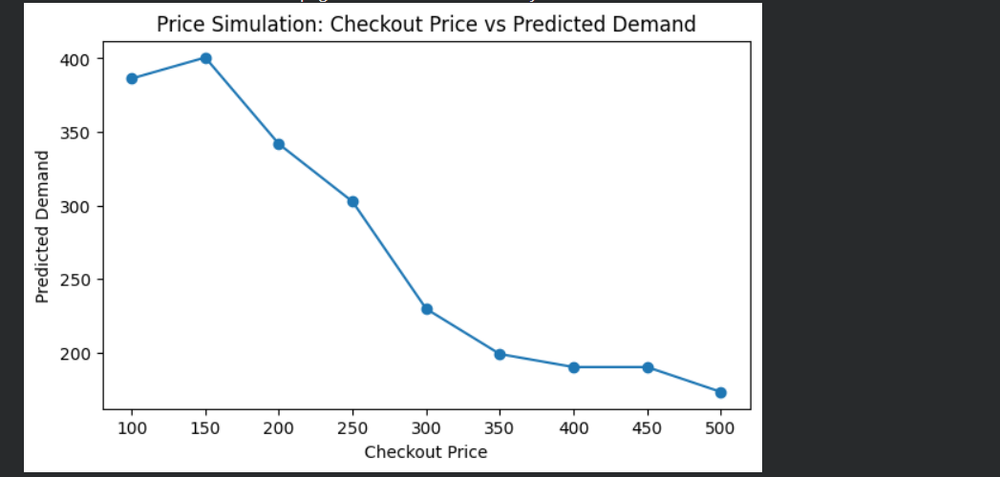

# 📊 Food Demand Forecasting & Promotion Optimization

This project predicts weekly food demand using machine learning and helps optimize pricing and promotional strategies for better business decisions.

---

## 🚀 Features
- 📈 Predict weekly demand based on pricing, promotions, and seasonality  
- 🎯 Analyze the impact of checkout price on demand  
- 📊 Price vs Demand simulation graph  
- 🧠 Feature engineering (discount, discount %, seasonal patterns)  
- 🖥️ Interactive dashboard using sliders (Google Colab)  
- 📌 Business recommendations based on predictions  

---

## 🧠 Model Used
- **CatBoost Regressor**
- R² Score: ~0.49  
- Handles both categorical and numerical features effectively  

---

## 📊 Sample Output

**Predicted Weekly Demand:** `1150 orders`

---

## 📸 Dashboard Preview

### 🔹 Interactive UI

### 🔹 Prediction Output

### 🔹 Price vs Demand Graph

---

## ⚠️ Note
The interactive dashboard (sliders & predict button) works in **Google Colab**.  
GitHub preview shows **static outputs only**.

---

## 🔗 Run Interactive Version
👉 [Open in Colab](https://colab.research.google.com/drive/1ixYCWmK8cI4s21lumWFHzsEA196z36Dy#scrollTo=Q_dxL7VkSHiJ)

---

## 📁 Project Structure
food-demand-forecasting/
│
├── Food_Demanding_Forecasting.ipynb
├── Food demand.csv
├── requirements.txt
├── README.md
│
└── images/
├── dashboard.png
├── output.png
└── graph.png

---

## 🛠️ Tech Stack
- Python  
- Pandas  
- NumPy  
- Matplotlib  
- Scikit-learn  
- CatBoost  
- ipywidgets  

---

## 💡 Key Insights
- Demand decreases as checkout price increases  
- Promotions and homepage visibility significantly boost demand  
- Discount percentage is a strong influencing feature  
- Seasonal patterns (weekly cycles) impact demand  

---

## 🎯 Future Improvements
- Deploy as a web app using Streamlit  
- Improve model performance (hyperparameter tuning)  
- Add real-time prediction system  
- Enhance UI for better usability  

---

## 👨‍💻 Author
**Punith Kumar**
